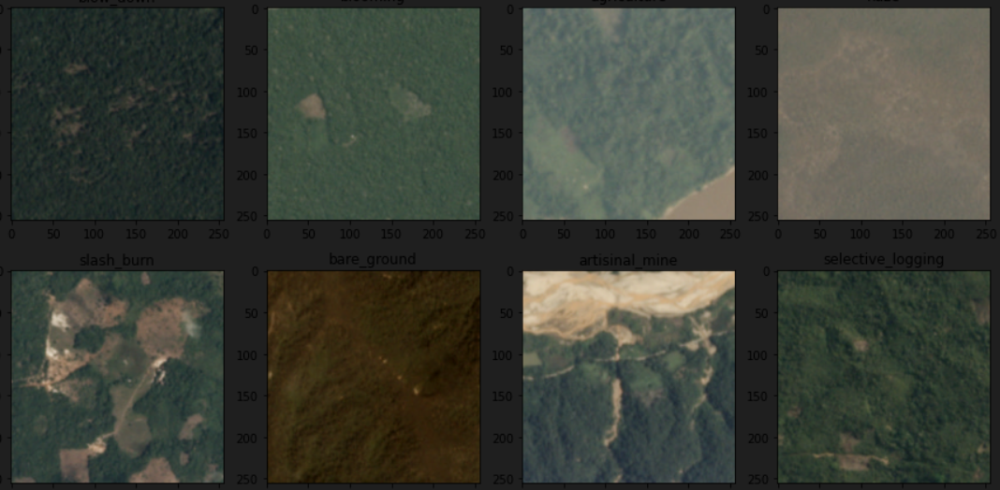

## Satellite Image Classification

---

The project utilizes the JPG version of the satellite images dataset [*Planet: Understanding the Amazon from Space*](https://www.kaggle.com/c/planet-understanding-the-amazon-from-space) and utilizes the Attention mechanism to achieve Multi-label classification through a CNN encoder and an RNN decoder, investigating the application of Computer Vision and Recurrent Neural Network algorithms at detecting phenomena like deforestation.

[Tensorflow v2 (Keras)](https://www.tensorflow.org/) platform was used for the neural networks creation. Network architecture based on [Image captioning with visual attention](https://www.tensorflow.org/tutorials/text/image_captioning) tutorial.

